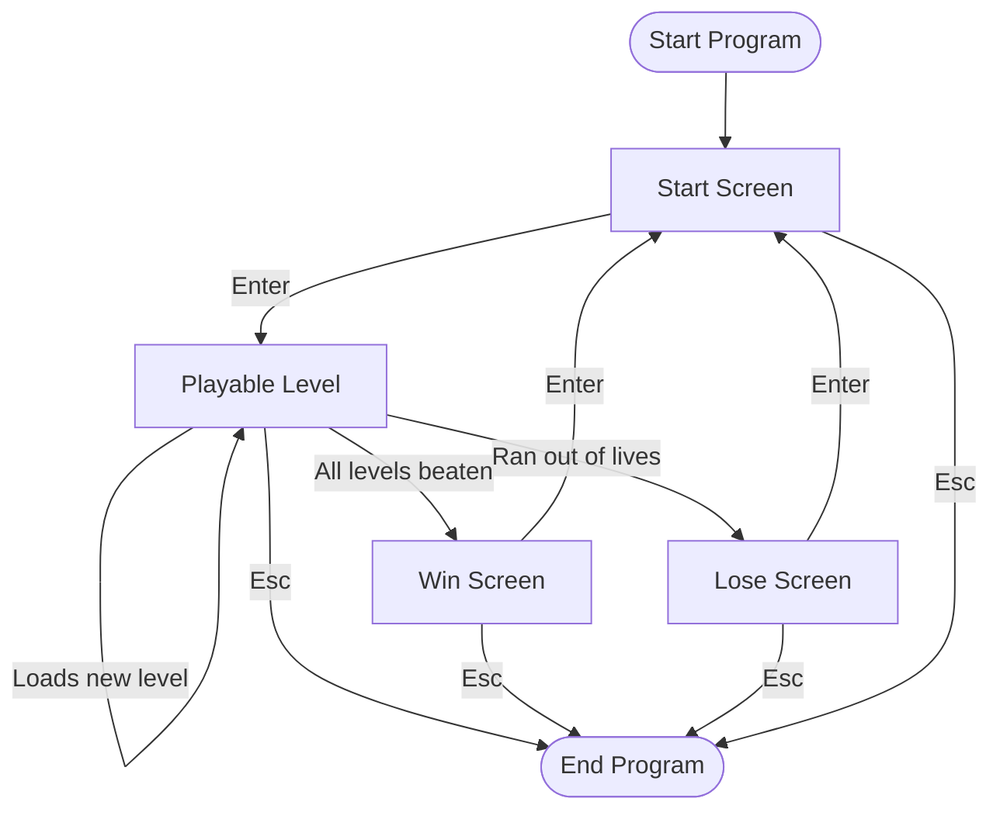

_This project has been created as part of the 42 curriculum by ldreger, mimeyer._

# Description

https://projects.intra.42.fr/projects/pac-man
https://github.com/42school/mlx_CLXV
https://www.spriters-resource.com/arcade/pacman/

# Instructions

# Resources

https://github.com/SaraFreitas-dev/MinilibX-42-Pyhton-Documentation/blob/main/MLX_DOCUMENTATION.md

# Details

## Configuration

## Highscore

## Maze Generation

## Implementation

## General Software Architecture

## Project Management
