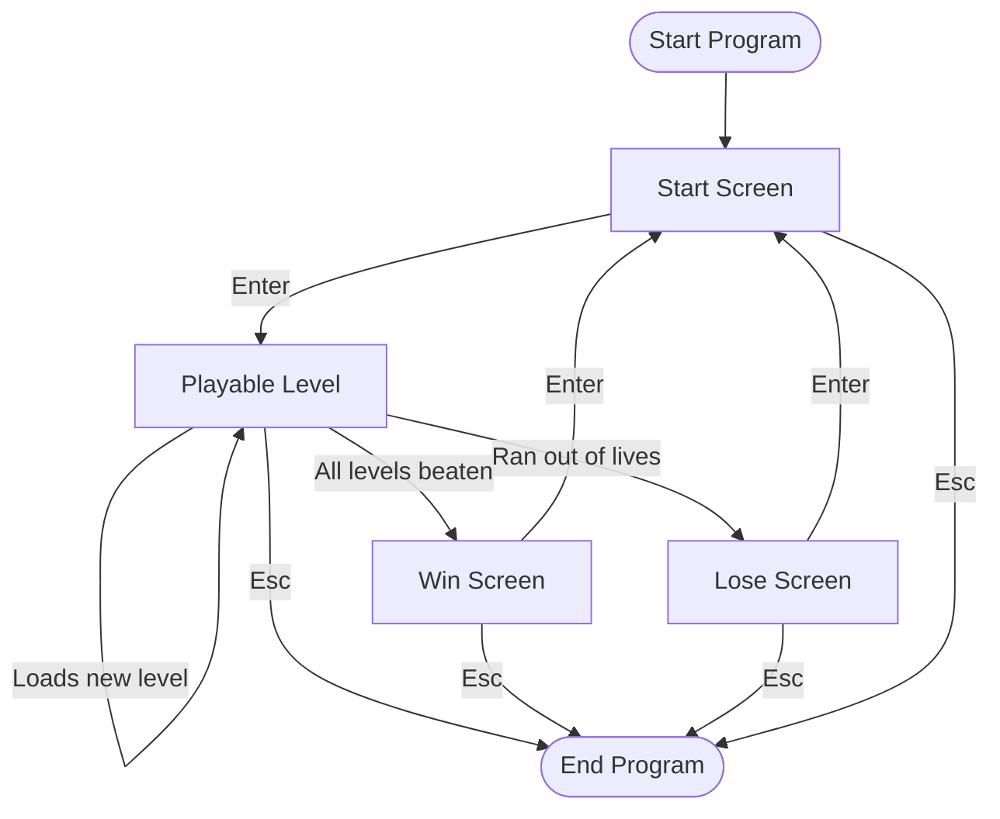

_This project has been created as part of the 42 curriculum by ldreger, mimeyer._

# Description

Pac-Man is a Python recreation of the classic maze game, developed for the 42
curriculum. Guide Pac-Man through generated mazes, collect pac-gums and
super pac-gums, avoid or eat the four ghosts, and try to complete each
configured level before time runs out. The game includes a main menu, gameplay,
win and game-over screens, a guide, and a persistent high-score table.

# Instructions

## Requirements

- Python 3.13
- [uv](https://docs.astral.sh/uv/) for environment and dependency management
- A graphical desktop environment supported by Pygame

The project restricts Python to `>=3.13,<3.14`. The assigned MazeGenerator
package is included as a wheel in this repository.

## Install and run

From the repository root, install the project dependencies and start the game:

```sh
make install
make run
```

`make run` loads `data/config.json` by default. To use another configuration
file, pass its path through `CONFIG`:

```sh
make run CONFIG=path/to/config.json
```

Equivalent direct invocation:

```sh
uv run python3 -m src.pac_man data/config.json
```

The game opens fullscreen. In-game movement uses the arrow keys or WASD. Use
Space to pause, Enter to continue or advance, and Escape to leave the current
game. The guide available from the menu lists the game controls.

Run static checks with `make lint`.

package
uv run pyinstaller --noconfirm --clean pac_man.spec

# Resources

- [42 Pac-Man project subject](https://projects.intra.42.fr/projects/pac-man)
- [Pygame documentation](https://www.pygame.org/docs/)
- [Python 3 documentation](https://docs.python.org/3.13/)
- [Pydantic documentation](https://docs.pydantic.dev/)
- [A-Maze-ing / MazeGenerator package](https://github.com/42school/AMazeing)
- [Pac-Man sprite resource reference](https://www.spriters-resource.com/arcade/pacman/)
- [MinilibX 42 Python documentation](https://github.com/SaraFreitas-dev/MinilibX-42-Pyhton-Documentation/blob/main/MLX_DOCUMENTATION.md)

AI assistance was used to inspect the existing project files and draft this
README, including its configuration, implementation, and architecture
descriptions. No AI-generated gameplay code or artwork is part of this
documentation change; this repository does not document other AI use.

# Details


```mermaid
flowchart TD
    start([Start Program])
    start_screen[Start Screen]
    level[Playable Level]
    win_screen[Win Screen]
    lose_screen[Lose Screen]
    finish([End Program])

    start --> start_screen
    start_screen -->|Enter| level
    level -->|Loads new level| level
    level -->|All levels beaten| win_screen
    level -->|Ran out of lives| lose_screen
    level -->|Esc| finish
    win_screen -->|Enter| start_screen
    win_screen -->|Esc| finish
    lose_screen -->|Enter| start_screen
    lose_screen -->|Esc| finish
    start_screen -->|Esc| finish
```


## Configuration

The game reads one configuration file path from the command line. The default
is `data/config.json`; it is a JSON object that allows `#`, `//`, and `/* ... */`
comments, which are removed before parsing. Unknown keys and invalid values
are rejected during validation.

Top-level settings are:

| Key | Default in `data/config.json` | Meaning |
| --- | --- | --- |
| `highscore_filename` | `./data/highscore.json` | File used to load and save scores |
| `level_count` | `3` | Number of levels played |
| `points.pacgum` | `10` | Points for a pac-gum |
| `points.super_pacgum` | `50` | Points for a super pac-gum |
| `points.ghost` | `200` | Points for a ghost |
| `width`, `height` | `10`, `10` | Fallback maze dimensions; each must be at least 3 |
| `lives` | `3` | Fallback lives per level; must be at least 1 |
| `pacgums` | `2` | Fallback number of collectible positions; `0` fills available positions |
| `super_pacgums` | `4` | Fallback number of super pac-gums |
| `timer` | `90` | Fallback time limit in seconds; must be at least 1 |
| `seed` | `67` | Fallback maze seed; use `null` for a random seed |
| `levels` | Three level entries are played | Optional per-level overrides |

The values in the table are the checked-in configuration's values. If a setting
is omitted, the code-level defaults are width 10, height 10, lives 3, pac-gums
0 (meaning all available positions), super pac-gums 4, timer 90 seconds, and a
random seed. Each entry in `levels` overrides those fallback values for its
stage; `level_count` controls how many entries are used.

## Highscore

Scores are stored locally as a JSON object in the file named by
`highscore_filename`, with player names as keys and scores as values. After a
win or game over, a player can enter an alphanumeric name of up to ten
characters. The menu reads the saved data and presents it in descending score
order. A plain JSON file keeps scores persistent between runs while remaining
easy to inspect, back up, or reset without requiring a database.

## Maze Generation

Each level uses the assigned `mazegenerator` package, supplied in the repository
as `mazegenerator-2.1.0-py3-none-any.whl`. The game passes the configured width,
height, and seed to `MazeGenerator`; a `null` seed is replaced with a random
integer. The resulting maze is a matrix of integer wall masks. The tile model
decodes each mask into top, right, bottom, and left wall flags, then builds
neighbor references used for rendering and character movement. A fixed seed
makes the generated layout reproducible.

## Implementation

The game is written in Python and uses Pygame for the fullscreen window, event
loop, sprite groups, animation, input, and drawing. Pydantic validates the
configuration, while the included MazeGenerator wheel creates each maze.
Sprites are loaded and cached from `data/spritesheet.bmp`; the renderer builds
maze tiles from wall metadata and draws the player, ghosts, collectibles, and
HUD. Player movement follows keyboard input, while four ghosts use individual
movement behaviors and pathfinding. The game loop manages levels, timers,
lives, collisions, scoring, and transitions between screens.

## General Software Architecture

The application is organized under `src/pac_man/`:

- `__main__.py` is the executable entry point. It loads and validates the
    configuration, then owns the Pygame lifecycle through `LoopMachine`.
- `loop/` contains the outer finite-state machine, gameplay loop, level
    lifecycle, menus, guide, win/death screens, and high-score screens.
- `models/` defines tile metadata and sprite construction, shared character
    behavior, the Pac-Man player, and the four ghost personalities.
- `render/` handles the HUD, sprite-sheet loading/caching, and text rendering.
- `utils/` contains configuration parsing/validation and shared position and
    direction structures.

`LoopMachine` selects the current screen-level state. When gameplay starts, it
creates a `GameLoop`; that loop asks the maze package for a maze, creates a
`Level`, and advances its game-level states. A `Level` converts the maze into a
connected tile matrix, creates the player and ghosts, and coordinates the
rendering and collectibles. The renderer consumes those models to draw the
current frame, while the HUD displays time, lives, and score.

## Project Management

We coordinated the project through GitHub, used Miro for collaborative
planning, and held frequent meetings to review progress and decide next steps.
The project-management overview is in the
[project management directory](project_management/). The GitHub repository is
[MikMey/PacMan](https://github.com/MikMey/PacMan); the Miro board link is not
stored in this repository.
